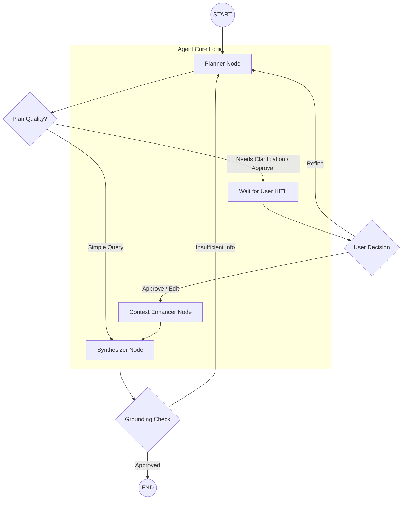

# 🧠 Research Agentic App

A high-performance, **iterative multi-agent research system** designed to solve complex information gathering tasks. Built with a **Human-in-the-Loop (HITL)** philosophy, it ensures research plans are accurate and grounded before execution.

---

## 🚀 The Problem & Solution

### The Challenge
Modern RAG (Retrieval-Augmented Generation) systems often struggle with **ambiguity** and **shallow research**. A single-shot retrieval often misses nuances or hallucinates when faced with complex, multi-faceted questions.

### Our Solution
This application leverages **LangGraph** to create a stateful, cyclic workflow. Instead of guessing, the agent:
1.  **Plans**: Breaks down the query into specific, verifiable sub-questions.
2.  **Collaborates**: Asks the user for clarification or plan approval (HITL).
3.  **Researches**: Executes parallel searches to gather multi-source context.
4.  **Synthesizes**: Produces a grounded, cited report with built-in quality retry logic.

---

## 🛠️ Tech Stack

### Backend
- **Core Orchestration**: [LangGraph](https://langchain-ai.github.io/langgraph/) for managing agent states and cyclic flows.
- **Search & Retrieval**: [Tavily AI](https://tavily.com/) for high-quality, researcher-aligned web results.
- **Text Processing**: [Rank-BM25](https://github.com/dorianbrown/rank_bm25) and [Sentence Transformers](https://www.sbert.net/) for reranking and context selection.
- **API Layer**: [FastAPI](https://fastapi.tiangolo.com/) providing high-speed asynchronous endpoints.
- **Data Integrity**: [Pydantic v2](https://docs.pydantic.dev/) for strict schema validation.
- **Persistence**: [PostgreSQL](https://www.postgresql.org/) for state-saving checkpointers (via `psycopg`).
- **Real-time**: WebSockets for streaming agent reasoning and progress.

### Frontend
- **Framework**: [React](https://react.dev/) with [Vite](https://vitejs.dev/) for an ultra-fast developer experience.
- **Icons & Display**: [Lucide React](https://lucide.dev/) for iconography and [React Markdown](https://github.com/remarkjs/react-markdown) for beautiful report rendering.
- **State Sync**: Custom hooks for WebSocket synchronization and stream handling.

### AI & Models
- **Provider Aggregator**: A custom `LLMProvider` supporting:
    - **Google Gemini** (1.5 / 2.5 Flash)
    - **Mistral/Gemma** (via OpenAI compatible endpoints)
    - **Qwen** (High-performance reasoning)

---

## 📐 Architecture

The intelligence of the system is encapsulated in its **StateGraph**. Below is the logical flow of the research process:

---

## 🧩 Key Components

- **Planner**: Acts as the brain. It decides if a query is "simple" (answer directly) or "complex" (needs research).
- **Context Enhancer**: The "arms" of the agent. It triggers search tasks and aggregates external knowledge.
- **Synthesizer**: The "editor". It weaves gathered facts into a coherent report with citations, ensuring everything is grounded in the retrieved context.
- **HITL Gate**: A dedicated node that halts execution, allowing users to modify the "Research Plan" before credit/token consumption occurs.

---

## ⚙️ Setup & Installation

### Prerequisites
- Python 3.10+
- PostgreSQL
- Node.js & npm

### Backend Setup
1. `cd agent`
2. `pip install -r requirements.txt`
3. Configure your `.env` (API Keys, Database URI)
4. `python main.py`

### Frontend Setup
1. `cd frontend`
2. `npm install`
3. `npm run dev`

---

## 📄 License
Distributed under the MIT License. See `LICENSE` for more information.

---
*Built with ❤️ for the future of agentic research.*
