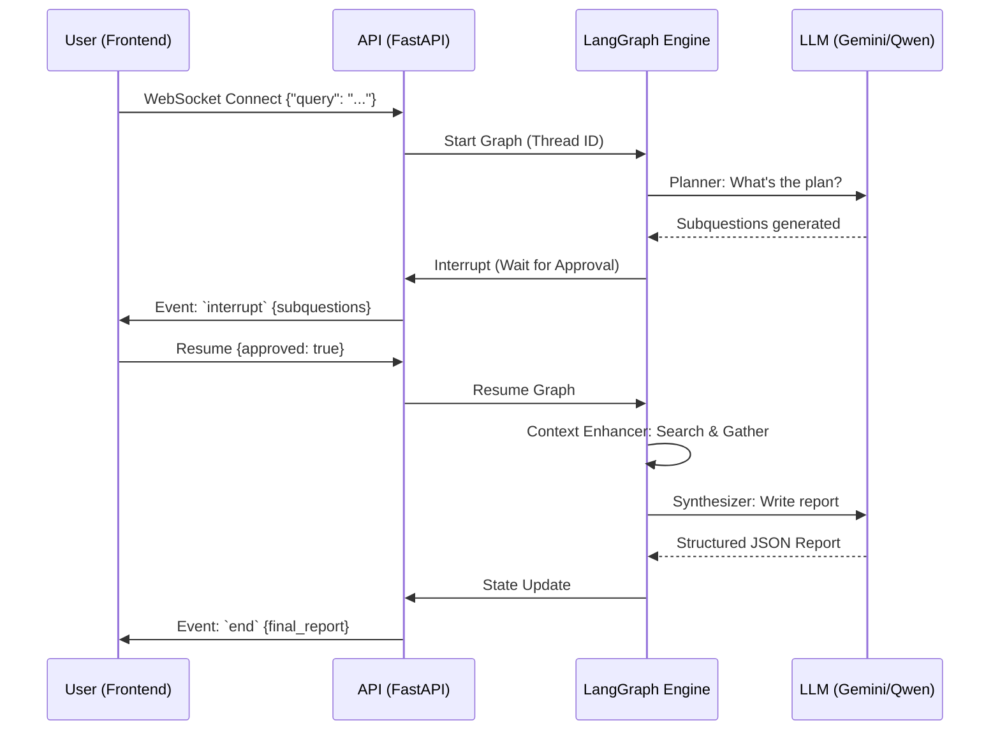

# 🏗️ System Architecture: Research Agent

This document provides a deep dive into the internal architecture, state management, and communication protocols of the Research Agent.

---

## 🗺️ High-Level Design

The Research Agent is built as a **stateful, directed graph** using [LangGraph](https://langchain-ai.github.io/langgraph/). Unlike linear pipelines, this architecture allows for cycles, conditional branching, and persistent memory (saving state between user interactions).

### Core Philosophy
1.  **Iterative Refinement**: The agent doesn't just search once; it gathers, synthesizes, and retries if the information is insufficient.
2.  **Grounded Knowledge**: Every sentence in the final report must be mapped to a specific search snippet to prevent hallucinations.
3.  **Human Alignment**: High-stake decisions (like which search queries to run) are gated by human approval.

---

## 💾 State Management: `ResearchState`

The entire lifecycle of a research task is captured in a shared state object. Any node in the graph can read and modify this state.

| Key | Type | Description |
| :--- | :--- | :--- |
| `user_input` | `str` | The original query or the latest feedback from the user. |
| `subquestions` | `List[str]` | The broken-down research plan (list of search queries). |
| `search_results` | `List[SearchResultModel]` | Raw data gathered from external sources. |
| `final_report` | `ReportModel` | The structured result with summary and cited sentences. |
| `iteration_count` | `int` | Tracks synthesis loops to prevent infinite cycles. |
| `plan_approved` | `bool` | Flag indicating if the user has green-lit the research plan. |

---

## 🔄 The Graph Workflow

The graph consists of several specialized nodes, each responsible for a distinct phase of the research.

### 1. Planner Node
- **Role**: The Architect.
- **Logic**: Analyzes the `user_input`. 
    - If the query is vague, it generates `clarifying_questions`.
    - If complex, it generates a list of `subquestions`.
    - If simple (e.g., "What is 2+2?"), it marks it for direct synthesis.

### 2. Wait for User (HITL)
- **Role**: The Gatekeeper.
- **Mechanism**: Utilizes LangGraph `interrupts`. The graph execution halts here and waits for an external signal (via WebSocket) to resume.
- **Purpose**: Allows the user to edit the search queries, provide extra context, or approve the plan.

### 3. Context Enhancer
- **Role**: The Researcher.
- **Logic**: Iterates through the `subquestions` and executes them in parallel using the **Tavily AI** search engine. 
- **Processing**: Once results are gathered, it uses **Rank-BM25** and **Sentence Transformers** to rerank chunks and select the most relevant context, ensuring the LLM isn't overwhelmed with noise. It populates the `search_results` with finalized text chunks and source URLs.

### 4. Synthesizer
- **Role**: The Editor.
- **Logic**: Takes the `search_results`, crafts a system prompt with grounded context, and produces a report. 
- **Citations**: Implements a mapping layer where numbers like `[1]` are converted back to real source URLs.

---

## 📡 Real-time Communication (WebSockets)

Because researchers can take time, the system uses WebSockets (`/ws/research`) to provide a live "inside look" into the agent's brain.

1.  **Event: `start`**: Handshake and `thread_id` generation.
2.  **Event: `update`**: Sent every time a node finishes execution. The UI uses this to show progress (e.g., "Planner is working...", "Researching 'Quantum Computing'...").
3.  **Event: `interrupt`**: The server notifies the client that it's waiting for human input. The client then sends back a response to "resume" the graph.
4.  **Event: `end`**: Final report delivered.

---

## 🛠️ Data Flow Diagram

---

## 🗄️ Persistence & Checkpointing

We use **PostgreSQL** as the checkpointer backend. This means:
- You can refresh your browser and resume a research task.
- Research history is saved and can be queried later using the `thread_id`.
- The graph can recover from crashes by reloading the last successful state.

---
*Generated by Antigravity AI - Documentation & Architecture Suite*
